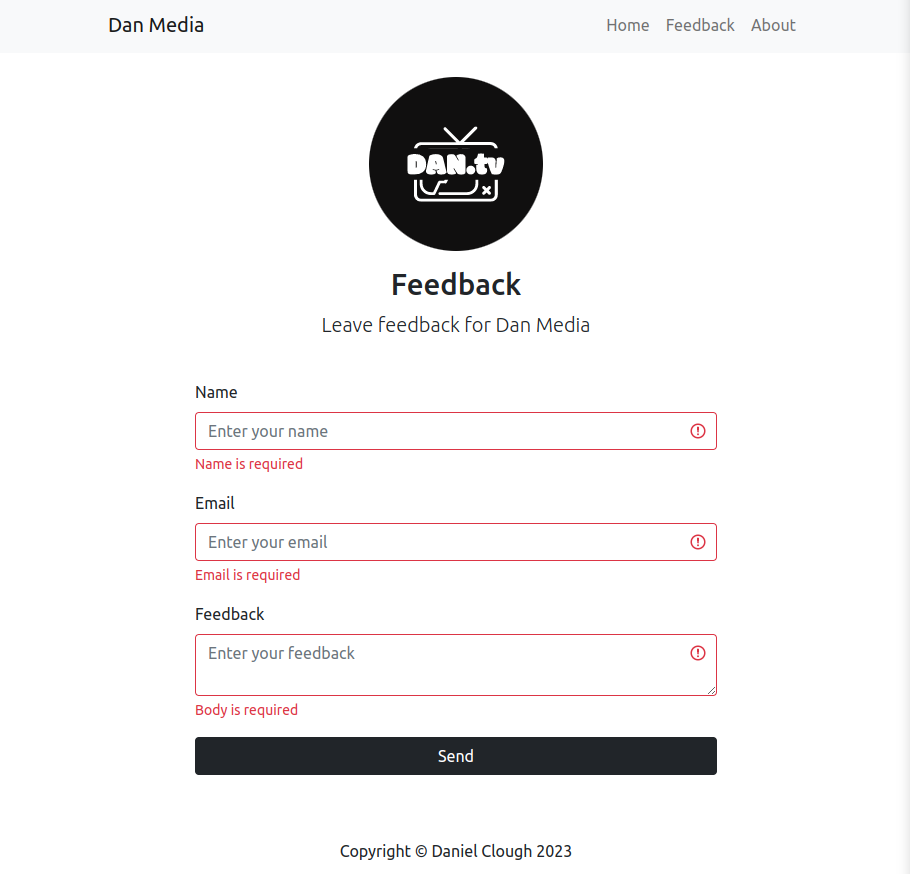
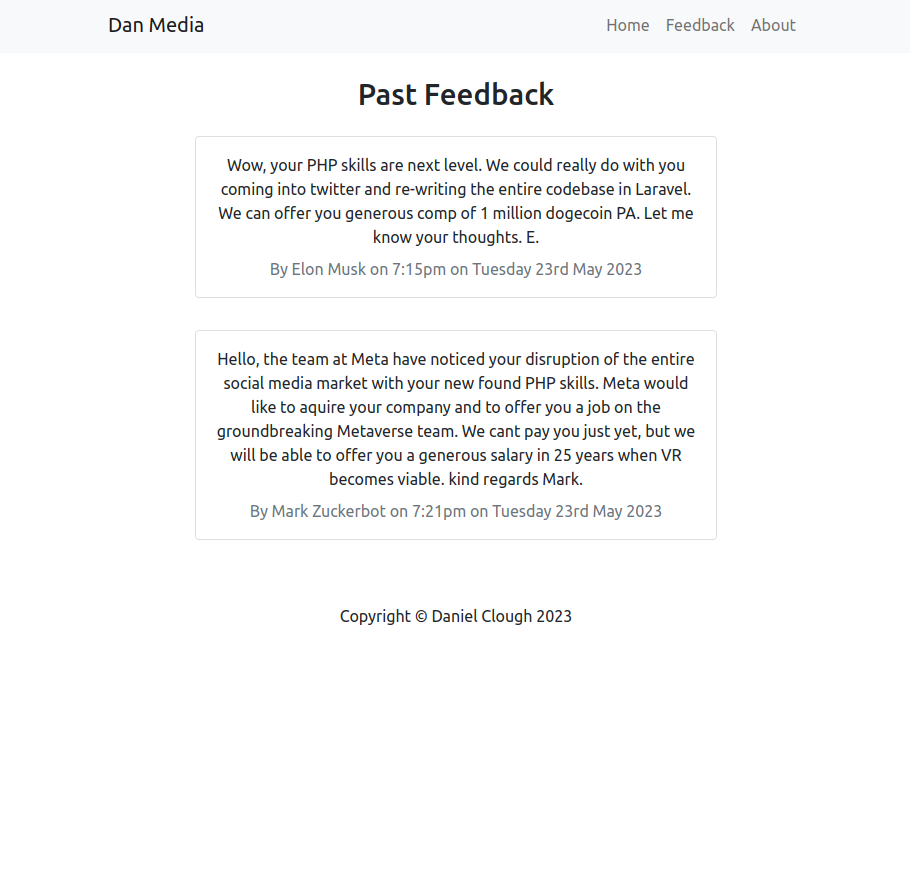
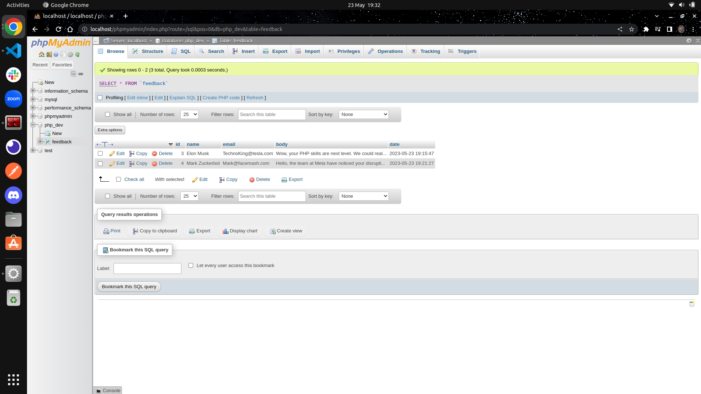
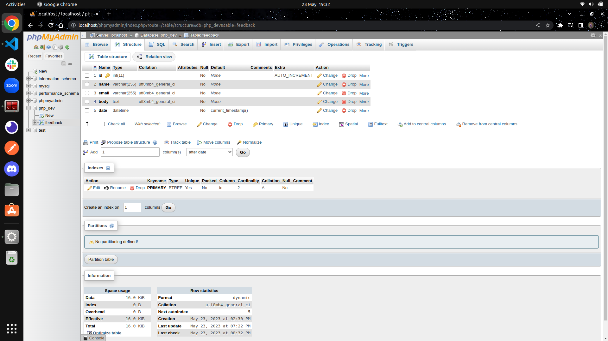

# PHP APP

PHP crash course and mini-app project. 

The completed course covered PHP fundamentals and resulted in this php sandbox and small vanilla php application that posts and gets data from a MySQL database and renders it on the appropriate pages. 

## Screenshots

